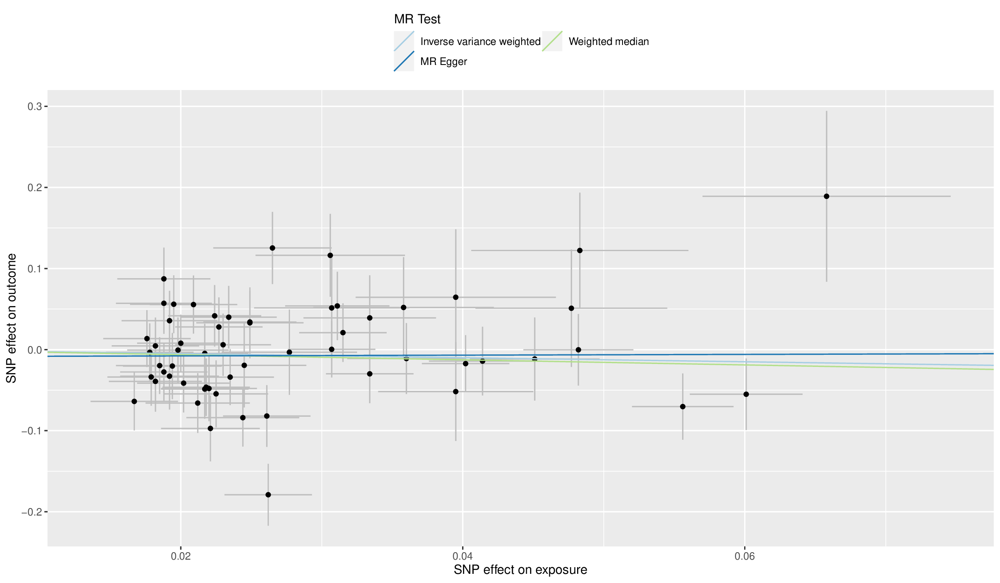
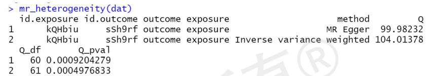
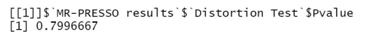
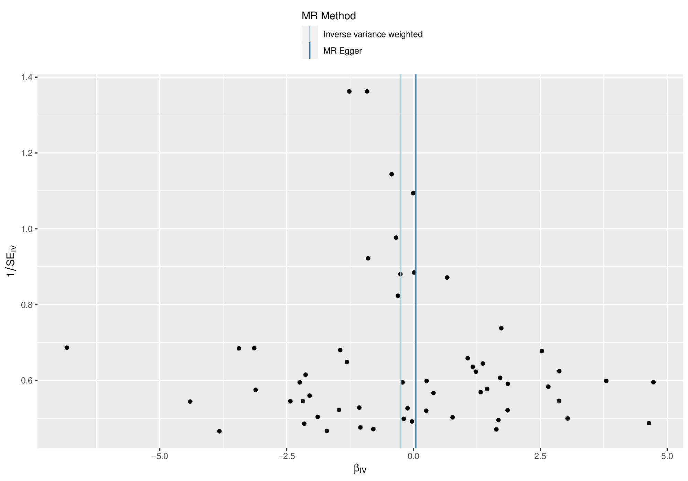
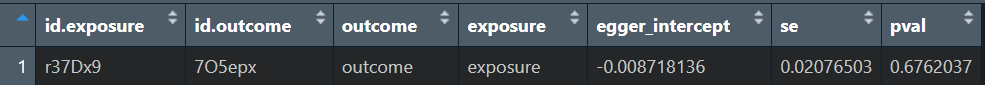
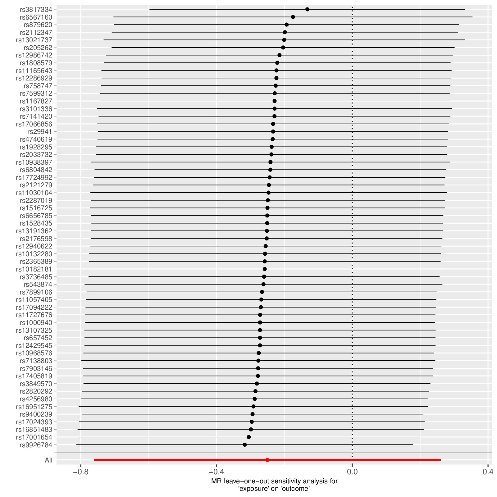

## 1，获取数据

- 现存 GWAS 数据样本大多为欧洲样本，少量其他样本

- 关键要点：暴露与结局数据不存在或存在少量可接受范围内的样本重叠

- 必须数据(`SNP` || `p` || `effct_all` || `other_all` || `OR(beta)` || `se`)

  - SNP_ID (rs123456)：唯一识别号

  - p_value：位点与表型的相关程度( 0 < p < 1)

  - effct_allele：变异位点

  - other_allele：常规位点

  - Beta：连续型变量的相对风险比，(R，大于 0 促进发生)

    - OR：二分类变量的相对风险比，(OR > 0，大于 1 促进发生)

    - Beta = ln(OR)

  - Standard error(se)：标准差，代表相对风险比的准确性

  - (非必须)Effect allele frequency(eaf)：效应位点频率，算工具变量的时候需要

## 2，读取数据

- 首先设置工作环境，文件名可以有路径

- "snp_gwas.tbl.txt" -> 直接用 `read.table()`读取，可加 `header = T`

  ```{R}
    data <- read.table("snp_gwas.tbl.txt",header = T)
    View(data)
  ```

- "snp_gwas.txt.gz" -> 直接用`read.table()`读取，可加`header = T`

  ```{R}
    data <- read.table("snp_gwas.txt.gz",header = T)
    View(data)
  ```

- "ieu-b-4979.vcf.gz" -> 利用`VariantAnnotation`和`gwasvcf`包将 vcf 格式文件转换成 tibble 格式文件，函数分别对应`readVcf()`和`vcf_to_tibble()`，后者 id 应该可以不加

  ```{R}
  data0=VariantAnnotation::readVcf("ieu-b-4979.vcf.gz")
  data1=gwasvcf::vcf_to_tibble(data0,id='ieu-b-4979')
  ```

## 3，将数据写入文件

- csv：一种以逗号为分隔符的文件格式，支持 excel 打开，适合存储表格数据
- 使用函数`write.csv()`，前一个变量是变量名，后一个 file = “文件名”

  ```{R}
  write.csv(data,file = "exposure.csv")
  ```

## 4，Exposure Data 处理，获得工具变量

- 相关性设置

  - 筛选条件：p < 5e-08 ( 视条件而定 )

  - 使用 base 包的 `subset( )` 即可
    ```{R}
    data_p <- subset(data,p < 5e-08)
    View(data_p)
    write.csv(data_p,file = "data_p.csv")
    ```

- 独立性设置

  - 首先将 subseted 的文件放在 TwoSampleMR 文件夹下

  - 筛选条件：LD 连锁不平衡，r^2 < 0.001(最大 0.1) , kb = 10000

  - 读取文件路径，使用`system.file()`函数，前一个参数是包下的相对路径，后一个参数是包名，主要作用是根据指定的包和文件路径获取完整的文件路径

    ```{R}
    road <- system.file("package_folder/exposure.csv",package = "TwoSampleMR")
    ```

  - 规范读取数据：利用 TwoSampleMR 包的 `read_exposure_data()` 规范读取数据，参数分为三个部分：文件路径、分隔符、规范列名

    ```{R}
    exposure_data <- read_exposure_data(

        filename = road,

        sep = ",",

        snp_col = "SNP_col_name",
        pval_col = "p_col_name",
        effect_allele_col = "effct_allele_col_name",
        other_allele_col = "other_allele_col_name",
        beta_col = "beta_col_name",
        se_col = "se_col_name",
        eaf_col = "eaf_col_name",

        clump = F ## 若为T则在读取的同时进行clump操作
        )
    ```

  - 独立性设置(clump): 利用 TwoSampleMR 包的 `clump_data()`，必须参数是上一步读取的数据 exposure_data，可设置参数是 clump_kb = 10000,clump_r2 = 0.001

    ```{R}
    exposure_data_clumped <- clump_data(exposure_data)
    ```

- 统计强度设置

  - F 值可放到后面计算，影响不大

  - F = R^2(N-2)/(1- R^2) (F > 10)

## 5，Outcome Data 处理，提取结局中的 snp

- 导入结局数据

  - 可能出现暴露和结局的效应等位基因不一致的情况

  - 可能出现暴露的部分 snp 在结局中没有，数量小可以容忍，数量大建议放弃

  - 丢失的 snp 可以通过找代理 snp 解决，但较麻烦

    ```{R}
    data <- read.table("outcome.txt",header = T)
    ## 如是其他文件格式，参见  “2，读取数据”
    ```

- merge，提取交集，得到 outcome 数据，第一个参数是 clump 过的暴露数据名，第二个参数是刚读取的结局数据名，后面 by.x 和 by.y 分别是暴露和结局的 snp 的 rs 编号的列名，得到的数据前一部分是暴露的，后一部分是结局的

  ```{R}
  outcome <- merge(
      exposure_data_clumped,
      data,
      by.x = "exposure_snp_col_name",
      by.y = "data_snp_col_name"
      )

    write.csv(outcome,file = "outcome.csv"  )
  ```

- 规范读取 outcome 数据，使用 TwoSampleMR 的 `read_outcome_data()`函数，第一个参数是暴露挑选出的工具变量，第二个参数是结局文件路径，第三个参数是间隔符，第四部分是列名

  ```{R}
  outcome_data <- read_outcome_data(

      snps =exposure_data$SNP,

      filename = "outcome.csv",

      sep = ",",

      snp_col = "SNP_col_name",
      pval_col = "p_col_name",
      effect_allele_col = "effct_allele_col_name",
      other_allele_col = "other_allele_col_name",
      beta_col = "beta_col_name",
      se_col = "se_col_name",
      eaf_col = "eaf_col_name",

  )
  ```

- 常见问题

  - 样本重叠，取最大值（具体待细查）

  - 结局的 snp 数量要足够多，merge 才能丢失最少的 snp

## 6，Harmonize Data 协同数据

- Harmonize 协同作用

  - 将 exposure_snp 和 outcome_snp 等位基因方向协同

  - 根据 eaf 大小，剔除不能判断方向的 palindromic snp

  - 剔除 incompatible snp (A/G vs. A/C)

- 使用 `harmonise_data()`即可，结果中会把 palindromic snp 和 incompatible snp 列出来并在 mr_keep 列标记为"FALSE"，意为在后面的 mr 分析中没有把这些 snp 纳入分析

- 注意要保存协同后的数据

  ```{R}
  dat_harmon <- harmonise_data(
    exposure_dat = exposure_dat_name,
    outcome_dat = outcome_dat_name
    )
  write.csv(dat_harmon,file = "dat_harmon.csv")

  ```

## 7，MR 分析，获得因果关系结果

- 可使用 `mr()`直接处理协同后的数据，默认使用五种方法分析(下列方法在函数中的命名)

  - mr_egger_regression
  - mr_weighted_median
  - mr_ivw
  - mr_simple_mode
  - mr_weighted_mode

  ```{R}
  dat_harmon_mr <- mr(dat_harmon)
  ```

- 也可使用`mr_method_list()`看函数有哪些方法，并指定使用哪些方法

  ```{R}
  dat_harmon_mr <- mr(
    dat_harmon,
    method_list = c(
      "mr_ivw",
      "mr_egger_regression",
      "mr_weighted_median"
      )
    )
  ```

- mr 分析可视化：使用`mr_scatter_plot()`，第一个参数是 mr 指定三种方法的分析结果，第二个参数是协同化的数据名

  ```{R}
  mr_scatter_plot(
    mr_results = mr(
      dat_harmon,
      method_list = c("mr_ivw",
                    "mr_weighted_median",
                    "mr_egger_regression"
                      )
      ),
    dat_harmon
  )
  ```

  

## 8，异质性检测，

- 异质性检测

  - 异质性：在 Mendelian 随机化（MR）研究中，异质性测试用于检查基因对因果效应的影响是否在不同基因位点之间存在显著差异。这有助于确定基因对因果关系的一致性

  - 有异质性说明结果不太靠谱，但在 mr 分析中，异质性对结果的可靠性影响不大

  - 使用 `mr_heterogeneity()`即可得到

  - 主要看 ivw 的 Q_pval ,叫做 Cochran Q test，小于 0.05 说明有异质性

    ```{R}
    dat_harmon_hetero <- mr_heterogeneity(dat_harmon)
    ```

    

- MR_PRESSO

  - 若要看产生异质性的斯 snp 是哪些，可以用 MR PRESSO，直接使用 TwoSampleMR 包下的`run_mr_presso()`函数，第一个参数是协同化的数据，第二个参数相当于迭代次数，snp 越多，数字要设置的越大，跑的深度越深，算出来的离群值越准确

  - 结果中会对每一个 snp 计算 p 值，小于 0.05 说明这个 snp 是离群值，Distortion Test $Outliers Indices 会指明是哪个 snp 的 p 小于 0.05

  - 结果中有一个 Distortion Test $Pvalue ,大于 0.05 说明离群值没有影响，小于 0.05 说明这个离群值对结果的方向有影响，即对 SNP 的 beta 或 OR 值的一致性有影响

    ```{R}
    run_mr_presso(alzheimer_and_bmi_harmon,NbDistribution = 3000)
    ```

    

- 异质性可视化

  - 使用`mr_funnel_plot()`,只有一个参数 singlesnp_results，需要使用`mr_singlesnp()`函数处理协同化的数据，这样即可得到漏斗图，越对称越好

    ```{R}
    mr_funnel_plot(singlesnp_results =
        mr_singlesnp(dat_harmon)
      )
    ```

    

## 9，多效性检测

- 多效性：多效性（Pleiotropy）是遗传学中的一个现象，指的是一个基因或基因变异影响多个表型特征，这些特征看似无关。这与“一个基因，一个特征”的原则相对立。多效性主要分为水平多效性和方向多效性两种类型，水平多效性代表特征之间没有强相关，方向多效性代表特征之间有强的关联

- 使用`mr_pleiotropy_test()`函数，唯一参数为协同化的数据，当结果的 pval < 0.05 时说明有多效性，大于 0.05 时说明没有多效性，取决于 egger_intercept 即 egger 分析的回归直线的截距，意为暴露效应为 0 时结局的效应值

- 多效性非常重要，一旦确认有多效性，结果极有可能不可靠

  ```{R}
  mr_pleiotropy_test(dat_harmon)
  ```

  

## 10，leave one out analysis

- 丢掉一个 snp 之后再次进行 mr 分析，如果是阳性结果，数据点应当都在 y 轴的一侧，有人要求更加严格，需要置信区间也都在 y 轴的一侧

- 如果是阴性结果，则数据应当跨越 y 轴

- snp 数量较少时效果比较大，snp 数量多时效果不大，但是为了研究的完整性，还是要做

- 使用函数`mr_leaveoneout_plot()`和`mr_leaveoneout()`，数据为协同化的数据

  ```{R}
  mr_leaveoneout_plot(
    leaveoneout_results =
      mr_leaveoneout(dat_harmon)
  )
  ```

  

## 补充：在线数据分析

- 在线提取数据，优点是方便，缺点是数据不够新

- 下面代码操作之后可以直接进入 harmonization 协同化

  ```{R}
  exposure <- extract_instruments(
    outcomes = "ieu-b-40"
    )
  View(exposure)

  outcome <-extract_outcome_data(
    snps = exposure$SNP,
    outcome = "ieu-b-2"
    )
  View(outcome)
  ```
