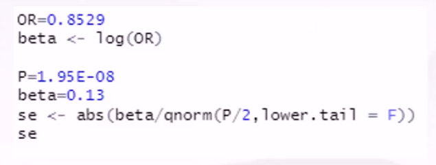
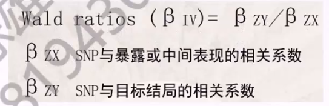
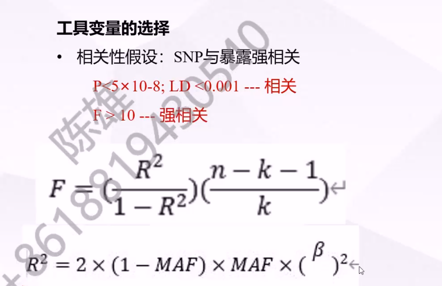

## 一、基本知识

- 核苷酸：单核苷酸是生物体内的基本结构单元之一，它包括一个**五碳糖分子**、一个**磷酸基团**和一个**含氮碱基**。核苷酸是构成核酸（DNA 和 RNA）的组成部分，它们通过磷酸二酯键连接成长链

  - 嘌呤（二元环）：腺嘌呤（A）、鸟嘌呤（G）
  - 嘧啶（一元环）：胞嘧啶（C）、胸腺嘧啶（T）、尿嘧啶（U）

  - DNA：ATCG 其中 A 与 T 配对（二氢键），C 与 G 配对（三氢键）
  - RNA：AUCG 其中 A 与 U 配对（二氢键），C 与 G 配对（三氢键）
    > ATCG AUCG
    >
    > TAGC UAGC

- SNP（单核苷酸多态性）：是基因组中常见的遗传变异形式，通常涉及**单个碱基**的替换。

  - 转换：嘌呤或嘧啶同类型替换
  - 颠换：嘌呤与嘧啶不同类型之间交换
  - 插入：插入一个碱基对
  - 缺失：缺失一个碱基对

  - 实际上发生的只有两种，即转换和颠换,二者之比为 2 :1

- GWAS(Genome-wide association study)即全基因组关联分析，主要目标是识别**基因**与特定性状或**疾病**之间的**关联**

- PCa: prostate cancer 前列腺癌

- MDD: major depressive disorder 严重抑郁症

- MR: mendelian randomization 孟德尔随机

- LD: linkage disequilibrium 连锁不平衡

- PRACTICAL consortium: Prostate Cancer Association Group to Investigate Cancer-Associated Alterations in the Genome Consortium 一个致力于研究前列腺癌的国际研究合作团体
- IVM: inverse variance weighted 逆方差加权
- MR-PRESSO：一种用于 Mendelian Randomization (MR) 分析的工具，旨在识别和校正可能的水平偏倚（horizontal pleiotropy）的影响。水平偏倚是指一个遗传变异对多个表型的影响，可能干扰了 MR 分析对因果关系的准确估计。

- eGFR（estimated Glomerular Filtration Rate）是估算的肾小球滤过率，用于评估患者的肾脏功能

- CKD 是慢性肾脏病（Chronic Kidney Disease）的缩写。慢性肾脏病是指肾脏逐渐失去功能并在较长时间内持续存在的疾病

- 多效性（Pleiotropy）是遗传学中的一个现象，指的是一个基因或基因变异影响多个表型特征，这些特征看似无关。这与“一个基因，一个特征”的原则相对立。多效性主要分为水平多效性和方向多效性两种类型，水平多效性代表特征之间没有强相关，方向多效性代表特征之间有强的关联

## 二、GWAS 数据解释

- OR：相对风险比，大于一促进发生，小于一抑制发生（二分类变量）
- Beta：连续型变量的相对风险比 Beta = ln(OR)
- p, Beta, se 三者知其二即可

  

- eaf(effect allele frequence)：效应位点频率，算工具变量的时候需要
- maf(main allele frequence)：其他位点频率
- se：标准差，代表 OR 的准确性

## 三、MR 分析

- 只有一个 snp 时可以进行 wald ratio 分析
  

- 多个 snp 就用 ivw 分析，其原理是综合每一个 snp 的 wald ratio 结果得到最终的 p 值

## 四、敏感性分析

- LD（连锁不平衡）：如果两个基因座之间存在连锁不平衡，意味着这些基因座的基因型并非独立的，它们可能一起传递给后代，而不是以预期的随机方式组合，这会影响 MR 分析结果的可靠性

  - 基因座：基因座是基因组上的一个特定位置，通常指的是染色体上的一个点，其中包含有关特定特征或性状的遗传信息
  - 连锁不平衡： 如果两个基因座之间存在连锁不平衡，这意味着这些基因座的特定基因型组合在群体中出现的频率高于或低于预期的随机水平

  - clump: 去除 LD 连锁不平衡的 snp，一般 R^2 < 0.001, kb = 10000

- F 值（统计强度计算）：可以在 clump 之后计算，也可以在最后一步计算，参数有 R^2、n（样本数）、k（工具变量个数），当 F > 10 就是强相关、强工具变量

  - 单个 SNP 计算：k = 1 即可，一个 SNP 就可以算出一个 R 平方
  - 多个 SNP 计算：k = SNP 数，R 平方用每个 SNP 算出来的 R 平方的和代替即可
    

- 对于潜在影响因素，可以先剔除后分析，也可以先分析再剔除再分析，比如偏倚的 snp

- 分析暴露与潜在风险因素之间是否有因果关系，可以通过将结局换成潜在风险因素的数据进行 mr 分析确定，如果 p 值大于 0.05 说明没有因果关系，这是好的

- 分析样本的 power，https://shiny.cnsgenomics.com/mRnd/ （疑似证书过期），power 大于 0.8 时可将结果放入论文
  - 二分类结局
    - power :一般 0.8
    - α :一类错误，一般选 0.05，相当于 p 值
    - K :病例数在样本中的比例，K = ncase/nsample
    - OR :MR_IVW 算出来的 OR 值
    - R^2 :就是计算 F 值的那个 R^2(要不要把所有 snp 的加起来不清楚)
  - 连续型结局
    - sample Size：样本量
    - α :一类错误
    - β[yx]：MR 分析得到的结果（猜测为 ivw 分析的 beta 值）
    - β[OLS]：观察性研究的 beta 结果，要看文献
    - R^2: F 值的 R^2
    - σ(x)：在结局中算的 R^2
    - σ(y)：在暴露中算的 R^2
